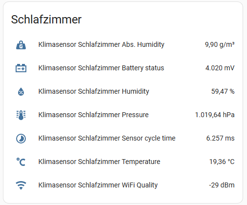

# ESP8266 Climate Sensor

This project provides an ESP8266 based climate sensor with the following features:

* MQTT status reporting / remote control
* Home Assistant integration with device autodiscovery
* Multi-Sensor display indoor/outdoor with Weather forecast
* Battery powered with deep sleep support

## Supported hardware

* ESP8266 Lolin D1 Mini with Deep-Sleep
* BME280 climate sensor (i2c-Mode)
* 200x200 WeAct EPD/eInk display (4-Wire SPI)

## Display & HA integration

Weather data is presented the following way using the eInk-Display:

The following sensors are automatically discovered by the HA MQTT auto discovery:

The device collects the following data points:

- Absolute humidity (calculated)
- Relative humidity
- Current battery voltage
- Air pressure
- Temperature
- Overall cycle time of the sensor for one measurement
- Wifi quality

## Schematics & Prototype

The KiCad 8.0 project is located in the kicad folder.

Here is the wiring schematic drawing:

## Manual

TBD
